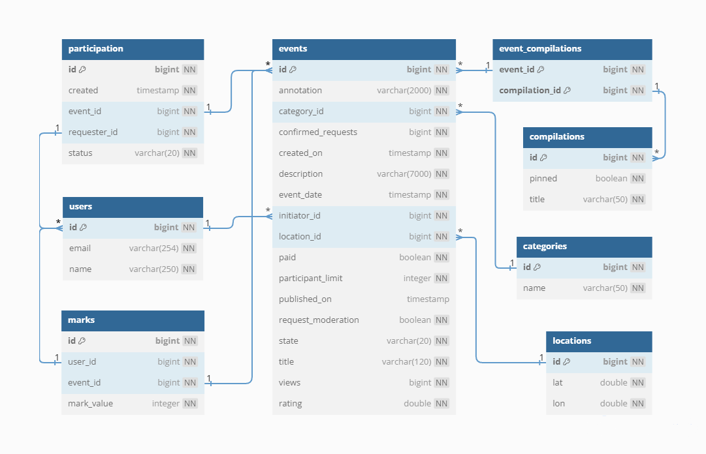
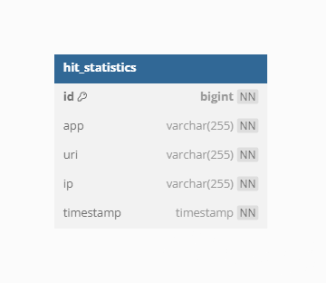

# java-explore-with-me
Данное приложение позволяет пользователям делиться информацией об интересных событиях и находить компанию для участия 
в них. А так же сохранять статистическую информацию о сделанных запросах.

## Функциональность

В приложении присутствуют 2 сервиса. Основной сервис и сервис статистики.

### ewm-service (Основной сервис)
Основной сервис (ewm-service) представляет собой приложение - афишу. 
В этой афише можно предложить какое-либо событие от выставки до похода в кино и собрать компанию для участия в нём.  
API основного сервиса разделено на три части:
- публичная, доступна без регистрации любому пользователю сети;
- закрытая, доступна только авторизованным пользователям;
- административная — для администраторов сервиса.  

Ниже приведён обобщённый список с функциями:
- Добавление, удаление и просмотр пользователей администраторами;
- Добавление, изменение и отмена событий пользователями;
- Поиск событий с возможностью фильтрации, а так же возможность редактирования данных события и его статуса 
администраторами;
- Добавление, изменение и удаление категорий событий администраторами;
- Добавление, изменение и удаление подборок событий администраторами;
- Получение информации по категориям и подборкам событий всеми пользователями, как списками, так и отдельно;
- Возможность подавать и отменять заявки на своё участие в событиях, а так же получать информацию о них, всеми 
пользователями;
- Просмотр информации о заявках на участие в своём событии пользователями, а так же возможность подтверждать или 
отменять их;
- Возможность оставлять оценки к посещённым событиям всеми пользователями, а так же изменять их;
- Получение рейтингов событий и пользователей, составленных на основе оценок к событиям, всеми пользователями;
- Получение рекомендаций к участию в будущих событиях, составленных на основе ранее оценённых событиях.  

### Оценки, рейтинги и рекомендации.
Отдельно стоит остановиться на оценках, рейтингах и рекомендациях.  
У пользователей, посетивших событие, есть возможность оставить оценку от 1 до 10 данному событию.
На основе этих оценок, составляются индивидуальный, а так же общий рейтинги событий. При чём, этот рейтинг формируется 
таким образом, чтобы событие всего с одной оценкой в 10 баллов не оказалось выше в рейтинге события с нескольким 
оценками по 9 баллов каждая. Суммарное значение всех оценок и количество оценённых событий, в свою очередь, формируют 
рейтинг пользователей. Логика формирования данного рейтинга похожа на предыдущую. В ней так же учитывается не только 
качество конкретного события, но и их количество. Тем самым пользователь с одним событием, оценённым на 10 баллов, не 
окажется в рейтинге выше, чем пользователь с большим количеством событий, но со слегка меньшей оценкой.  
Рекомендации.  
Алгоритм рекомендаций работает следующим образом: Сначала выявляются все пользователи, посетившие те же события и 
оценившие их, что и целевой пользователь. Далее высчитывается тот пользователь, чья разница в оценках будет минимальная,
т.е. пользователь с максимально похожими "вкусами". Затем, в качестве рекомендаций, целевому пользователю предлагаются 
все события, на которые подал запрос на участие "похожий" пользователь. Если данный список окажется недостаточным, 
меньше 5, то он дополняется событиями, созданными пользователями с верхних позиций рейтинга.

### Тестирование.
Тестирование осуществляется с помощью Postman-тестов. Соответствующая коллекция тестов сохранена в файле 
[feature.json](postman/feature.json).
#### !!!Внимание!!!
В логике приложения есть особенности добавления событий, последующего обновления их статуса администраторами и 
добавления оценок, а именно:
- нельзя добавлять события, дата начала которых раньше чем через 2 часа после добавления;
- нельзя публиковать события, начало которых раньше чем через 1 час после публикации;
- оценку можно добавлять только к событиям, в которых пользователь участвовал, и они завершились.

В связи с чем не представляется возможным написать стандартные Postman-тесты, в которых будут последовательно 
воспроизводиться все шаги для добавления оценок. Временной интервал такого теста растянется на 2 часа.  
Данная проблема решается добавлением необходимой предварительной информации из файла 
[data.sql](ewm-service/src/main/resources/data.sql) в БД в момент загрузки приложения.  
Если вы хотите запустить приложение НЕ в тестовом режиме, наличие данного файла необходимо учитывать.

## Схемы баз данных
### ewm-db

### stats-db

